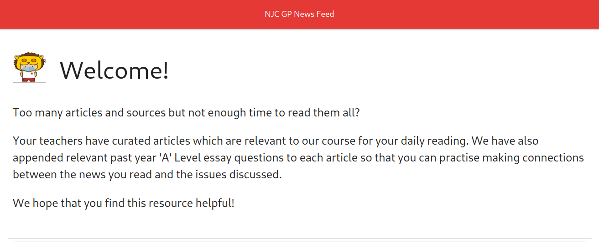
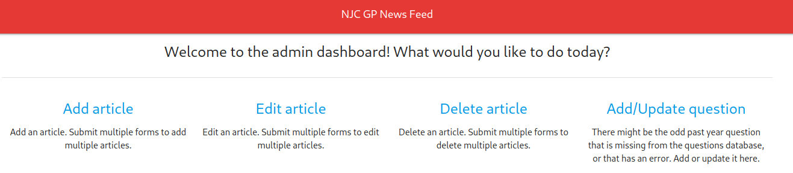
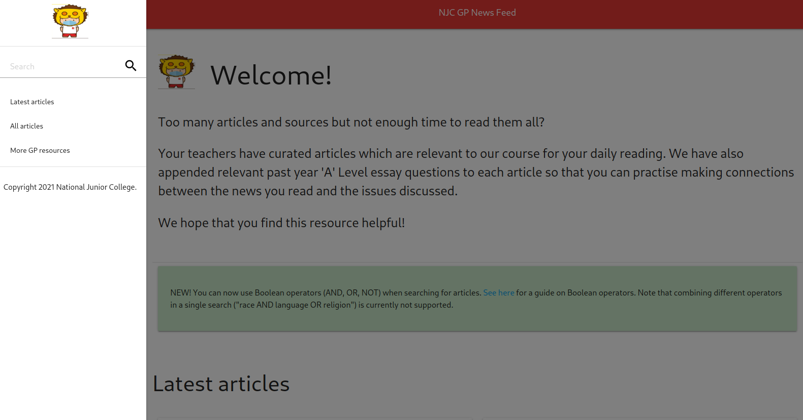
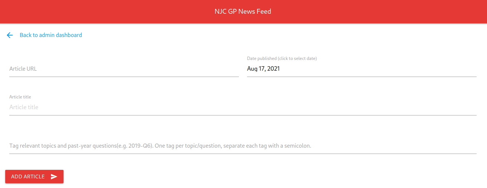

<h1 align="center">NJC GP News Feed</h1>

---

A key aspect of the General Paper syllabus is that students need to stay up to date with the current affairs of the day. Without substantial current affairs knowledge, students will not be able to practise and apply critical thinking skills to any reasonable depth and extent. Thus, regular reading of the news is essential. However, there are many news outlets, each pumping out an unrelenting slew of content on a daily basis. This can leave many students at a loss as to where to start when they resolve to cultivate a reading habit. 

The NJC GP News Feed is an attempt at providing students with a resource to guide them along the way. At its core, it is a simple CRUD web app. A small team of teachers curates articles deemed to be most pertinent to the curriculum on a daily basis, and updates a database of articles. The app exposes basic CRUD functionality to the team. Since teachers are not expected to be technical people, the app attempts to simplify the process as much as possible without requiring the team to worry about the technical implementations.

This database of articles is available for students' viewing in various ways, like the `Latest articles` landing page, or through the `search` function which they can use to search the database by keywords or phrases, topics, or past year questions.

## Features

### For students:
- Teacher-curated articles from a variety of sources.
- Each article entry comprises the article title, a link to the original article at its source, as well as tags.
- Each article is tagged with the relevant topic(s), as well as relevant past year exam questions. This is meant to provide a prompt for students to draw connections between what they read in the news and what they learn in the classroom.
- A search function that returns all articles that contain the search term(s) in:
  - the article title
  - topic tags
  - past year question wording
  - past year question year and question number listing
  - publish date
- Boolean search (AND, OR, NOT) is supported but not currently supporting combinations of boolean operators ("a" AND "b" NOT "c"). 

### For teachers:
- Simple form to add new articles. The form attempts to remove as much tedium from the process as much as possible so that the curation is sustainable for teachers - automatic population of the article title (simply copy and paste the url of the source), topics and questions tags keyed in the same field and parsed automatically by the app. 

- Ability to edit articles. Teachers need to simply select the article that they wish to edit from a list of existing articles, and they will be presented with a form to make the necessary changes.
- Ability to delete articles. Teachers need to simply select the article that they wish to delete and it's gone from the database.
- Ability to add or update past year questions. There could be some past year questions that were missed out when setting up the initial database of past year questions, or that have some minor error that needs correcting. Teachers can use this function to do so.

## Acknowledgements
- [Materialize](https://github.com/materializecss/materialize) 
